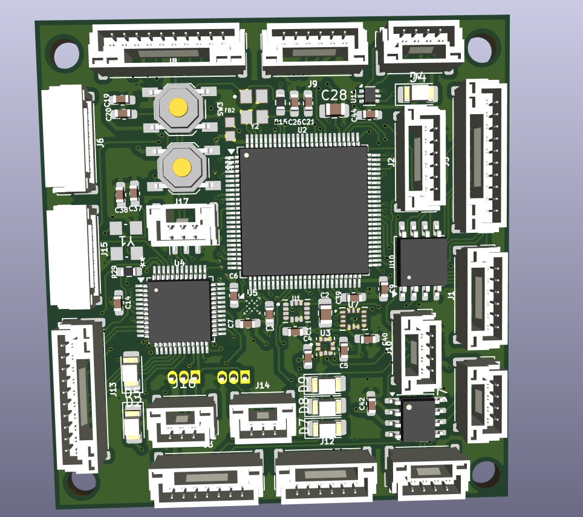
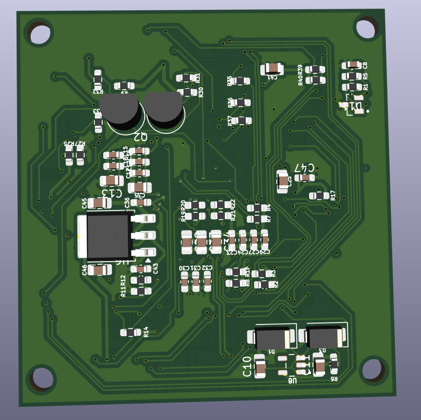
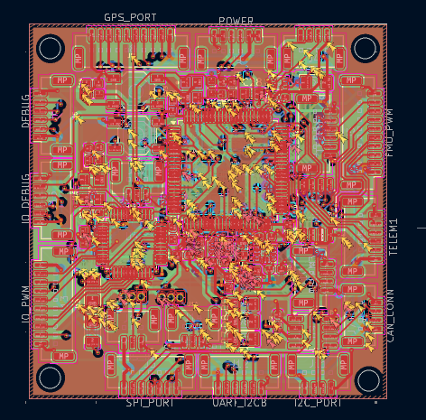

# Custom Flight Controller PCB

A custom-designed flight controller PCB developed for embedded flight-control applications, integrating a high-performance STM32 MCU, multiple inertial and pressure sensors, CAN communication, external flash memory, power management, and dedicated FMU/IO interfaces.

The PCB and schematic were designed using **KiCad 9.0.7**.

---

## 📌 Project Overview

This project focuses on the design and development of a custom flight controller PCB with dedicated interfaces for sensors, communication peripherals, power, debugging, telemetry, PWM outputs, and RC input/output.

The design is divided into multiple functional sections:

- Main Flight Management Unit (FMU)
- IO controller
- IMU and pressure sensing
- CAN communication
- USB connectivity
- External SPI flash memory
- Power regulation
- Telemetry interfaces
- PWM and RC interfaces
- Debug/programming interfaces

---

## ✨ Key Features

- Custom PCB designed from schematic to board layout
- STM32F765VITx main flight controller MCU
- STM32F103CBTx dedicated IO controller
- Multiple onboard sensors
- CAN communication interface
- USB OTG interface
- External SPI flash memory
- Multiple UART interfaces
- I2C and SPI interfaces
- PWM output interface
- SBUS and PPM interfaces
- Debug/programming interface
- Dedicated GPS and telemetry connectors
- Onboard status/safety LEDs
- 3.3 V and 5 V power domains
- Multi-layer PCB layout
- Manufacturing-ready Gerber and drill files

---

## 🧠 Hardware Architecture

### Main Flight Controller

The primary processing unit is an **STM32F765VITx**.

The MCU provides the main processing and peripheral interfaces for the flight-control system, including:

- SPI
- I2C
- UART
- CAN
- Timer/PWM channels
- SWD debugging
- External GPIO

### IO Controller

A dedicated **STM32F103CBTx** is used for the IO section of the design.

The IO controller provides interfaces for:

- SBUS
- PPM
- PWM
- RC input/output
- Safety signals
- Status LEDs
- Debugging
- Additional UART interfaces

---

## 📡 Sensors

The design incorporates multiple sensors:

### ICM-42688-P

6-axis inertial measurement sensor connected through SPI.

### BMI270

6-axis inertial sensor with dedicated interrupt and SPI connections.

### ICP-20100

Pressure sensor connected through the I2C interface.

### BMM150

Magnetic sensor connected through the I2C interface.

---

## 🔌 Communication Interfaces

### CAN

CAN communication is implemented using the **SN65HVD230** transceiver with dedicated CANH and CANL connections and protection circuitry.

### USB

A USB OTG interface is provided along with USB ESD protection using **USBLC6-2P6**.

### UART / Telemetry

Dedicated connectors are provided for:

- TELEM1
- TELEM2
- TELEM3
- UART/I2C interface
- GPS
- FMU communication

### I2C

Multiple I2C buses are available for sensor and peripheral communication.

### SPI

Multiple SPI buses are routed to sensors, flash memory, and external interfaces.

---

## 💾 External Flash Memory

The board includes external SPI flash memory:

**W25Q128JVS**

The flash device is connected to the main MCU through SPI with a dedicated chip-select signal.

---

## ⚡ Power Management

The PCB contains dedicated power regulation and filtering circuitry for the different system power domains.

The design includes:

- 5 V input
- 3.3 V regulation
- USB 5 V input
- External 3.3 V supply
- Decoupling capacitors
- Ferrite filtering
- Power indication circuitry

The schematic includes regulators such as:

- LM1117DT-3.3
- TLV75733PDBVR

---

## 🎛️ Interfaces & Connectors

| Interface | Purpose |
|---|---|
| GPS_PORT | GPS connectivity |
| POWER | Power input |
| TELEM1 | Telemetry |
| TELEM2 | Telemetry |
| TELEM3 | Telemetry |
| CAN_CONN | CAN communication |
| USB_OTG | USB connectivity |
| DEBUG | Debug/programming |
| SPI_PORT | External SPI interface |
| I2C_PORT | External I2C interface |
| UART_I2CB | UART/I2C interface |
| FMU_PWM | PWM outputs |
| IO_PWM | IO PWM interface |
| SBUS_PORT | SBUS interface |
| SBUS_IN | SBUS input |
| PPM_PORT | PPM input |
| IO_DEBUG | IO debugging |

---

# 🖥️ PCB Design

## 3D View – Top



## 3D View – Bottom



## PCB Layout



---

# 📐 Schematic

The complete schematic is provided as a multi-page KiCad schematic covering:

1. FMU / MCU power and peripherals
2. USB and CAN
3. IMU and sensor interfaces
4. IO controller
5. Safety, RC and PWM interfaces

The PDF version is available in:

`docs/schematic.pdf`

---

# 🏭 Manufacturing Files

The `gerbers/` directory contains the manufacturing outputs generated from KiCad, including:

- Front and back copper
- Inner copper layers
- Front and back solder mask
- Front and back silkscreen
- Paste layers
- Board outline
- Drill files
- Gerber job file

These files can be supplied to a PCB manufacturer for fabrication.

---

# 📦 Bill of Materials

A Bill of Materials generated from the KiCad schematic is included in:

`manufacturing/BOM.csv`

The BOM contains information such as:

- Reference designators
- Component quantity
- Component value
- PCB footprint
- Datasheet information
- BOM exclusion fields

---

# 📁 Repository Structure

```text
Custom-FC-RAT/
│
├── README.md
├── custom_fc_rat.kicad_pro
│
├── schematic/
│   └── custom_fc_rat.kicad_sch
│
├── pcb/
│   └── custom_fc_rat.kicad_pcb
│
├── gerbers/
│   ├── *.gbl
│   ├── *.gtl
│   ├── *.gbs
│   ├── *.gts
│   ├── *.gbo
│   ├── *.gto
│   ├── *.gm1
│   ├── *.g1
│   ├── *.g2
│   ├── *.g3
│   ├── *.g4
│   ├── *.drl
│   └── *.gbrjob
│
├── manufacturing/
│   └── BOM.csv
│
├── images/
│   ├── pcb_3d_top.png
│   ├── pcb_3d_bottom.png
│   └── pcb_layout.png
│
└── docs/
    └── schematic.pdf
```

---

# 🛠️ Design Tools

| Tool | Purpose |
|---|---|
| KiCad 9.0.7 | Schematic & PCB design |
| KiCad 3D Viewer | PCB visualization |
| KiCad Gerber Generator | Manufacturing file generation |

---

# 🚀 Future Improvements

Possible future development includes:

- Hardware validation and bring-up documentation
- Flight-controller firmware integration
- Sensor calibration and validation
- Power integrity testing
- Communication interface testing
- EMI/EMC validation
- Flight testing
- PCB revisions based on hardware testing

---

# 📄 Documentation

The editable KiCad design files and schematic PDF are included so that the hardware design can be inspected and further developed.

---

# 👩‍💻 Author

**Ekta Gupta**

Custom PCB / Flight Controller Design Project

---

## ⭐ Project Status

**Hardware Design Completed**

Schematic, PCB layout, 3D visualization, BOM, and manufacturing files are included in this repository.
